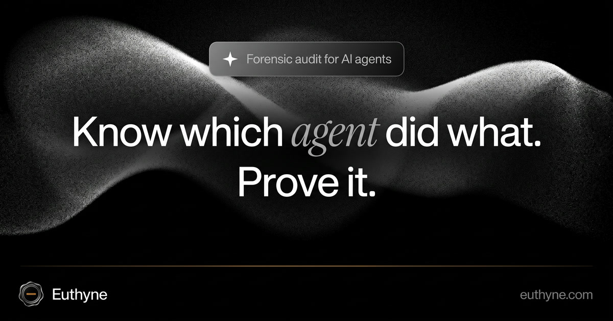

  

# Euthyne

**Forensic audit for AI agents.** Know which agent did what. Prove it.

Every action an AI agent takes becomes a signed, tamper-evident receipt: which agent acted, on whose behalf, with which model and under which policy. Receipts are hash-chained, content is end-to-end encrypted, and identities resolve on the [Verana](https://verana.io) trust registry.

We are in private beta. [Request access](https://euthyne.com/#access) · [hello@euthyne.com](mailto:hello@euthyne.com)

[Website](https://euthyne.com) · [X](https://x.com/euthynehq) · [LinkedIn](https://www.linkedin.com/company/euthyne-labs/)
